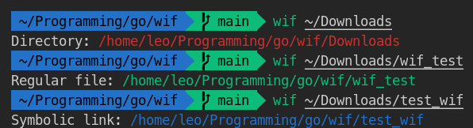

# WIF (Where is the file?)

I find it annoying sometimes having to do a ```pwd``` and then copy the name of the file I want.

For that I created the WIF. 

You pass as the first argument the name of your file and it identifies if it is a regular file, directory or symbolic link and brings you the entire path.

Like that:

